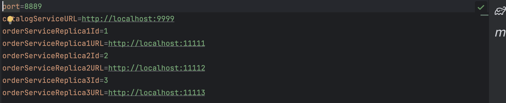
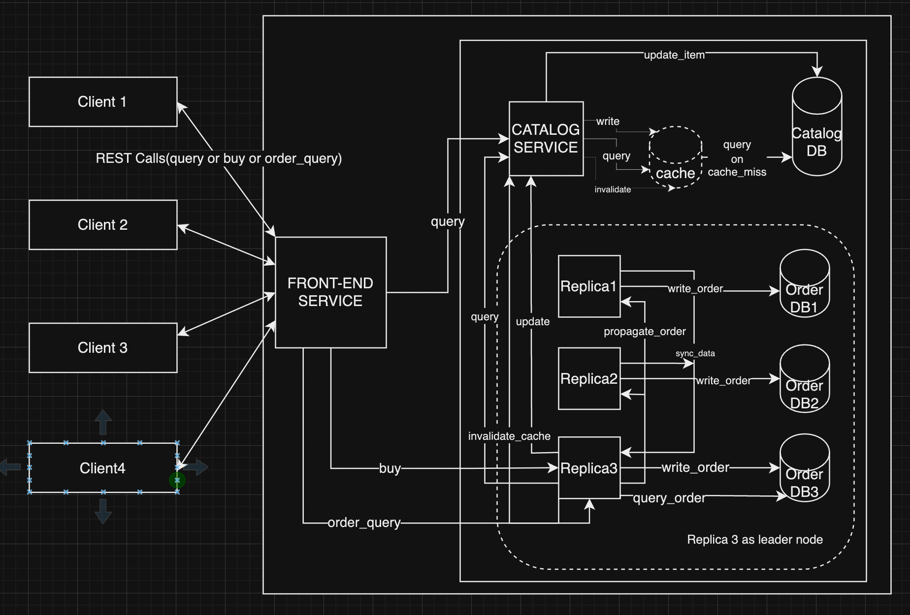

## 1. Problem Statement
Design a two-tier Toy Store (a front-end tier and a back-end tier) using microservices at each tier. The front-end is implemented as a single microservice, while the back-end is implemented as two separate services: a catalog service and an order service. Toy Store should also support adding caching, replication, and fault tolerance.

## 2. Goals

- **Front-end Service** : The clients can communicate with the front-end service using the following two HTTP-based REST APIs. A client sends its request as an HTTP request and receives a reply as an HTTP response. Front-end service will request backend-services further.
- **Catalog Service** : When the front-end service receives a query request, it will forward the request to the catalog service.The catalog service will maintain the catalog data, both in memory and in a CSV.
- **Order Service** : When the front-end service receives an order request, it will forward the request to the order service.The order service will interact with catalog service to update quantity and return's orderId if success
- **Caching** : Cache consistency needs to be addressed whenever a toy is purchased or restocked.Catalog server sends invalidation requests to the front-end server after each purchase and restock.Your cache implementation must include a cache replacement policy such as LRU .
- **Replication** : Start three replicas of the order service, each with a unique id number and its own database file.Front-End will do leader election. When a purchase request or an order query request, the front-end service only forwards the request to the leader. In case of a successful purchase (a new order number is generated), the leader node will propagate the information of the new order to the follower nodes to maintain data consistency.
- **Fault Tolerance** :When any replica crashes (including the leader), toy purchase requests and order query requests can still be handled and return the correct result. We also want to make sure that when a crashed replica is back online, it can synchronize with the other replicas to retrieve the order information that it has missed during the offline time.
- **Consensus using RAFT** :  Implement a RAFT consensus protocol that uses state machine replication so that all replicas can order incoming writes and apply them to the database in the same order.

## Design 

### 3.1 Front-end Service :

The clients can communicate with the front-end service using HTTP-based REST APIs.

We are using `HttpURLConnection` Java library to establish connection and make requests and `com.sun.net.httpserver.HttpServer`  Java Server library which doesn't have built-in support for persistent connections. But we can set the Connection header to `keep-alive` to indicate that the connection should be kept alive for subsequent requests.

When a client sends multiple requests to the server over the same TCP connection, it's using a persistent connection. This means that after the initial TCP handshake and HTTP request-response cycle, the connection is kept open for subsequent requests, which can be sent and received without the overhead of establishing a new connection each time. So, while the same connection may be used for multiple requests, each request is still processed by a separate thread on the server side.

The server will be listening for incoming requests over HTTP and assign them to a thread pool. The thread will first parse the HTTP request to extract the GET/POST command. If the request method is neither GET nor POST, it responds with status code 405 `(METHOD_NOT_ALLOWED).`

### 3.2 Catalog Service :
When the front-end service receives a query request, it will forward the request to the catalog service.

**3.2.1 Product Catalog :**

On initialising catalog service , it will read CSV file from disk and load it into memory creating a in memory-database.

Here we will be using 2 locks to synchronize the access to the product catalog data.

1. loadLock - Lock to synchronize the loading of data from CSV.

2. locks - Locks to synchronize the access to the individual items in the product catalog as we need not lock entire product catalog, we can just take lock on the item which is being accessed.

We are using ConcurrentHashMap to store the product catalog data as it provides thread-safe operations. (We are storing 15 items)

We'll start a fresh background thread to perform scheduled writing to a CSV file every minute.

We'll start a fresh background thread to perform to restock items, when ever toys goes out of stock , this thread will every run every 10 secs updates in-memory map which is later on updated in CSV by above background thread operation

### 3.3 Order Service :
When the front-end service receives a buy request, it will forward the request to the order service. Order Service will query catalog , check if requested quantity is less than available quantity,if so then sends a request to catalog service to update item quantity(available-requested).

**3.3.1 Order DB :**

On initialising order service , it will read CSV file from disk and load it into memory creating a in memory-database.

When we initialise order DB we will read the max order number and whenever a new request comes we increment this.

We will be using below code snippet to place order.

```
public synchronized int placeOrder(String itemName, int quantity) {
    // Generate order number
    int newOrderNumber = orderNumber.incrementAndGet();

    // Schedule order log writing task asynchronously
    executor.submit(() -> writeOrderLog(newOrderNumber, itemName, quantity));

    return newOrderNumber;
}
```
Here a background thread is used to perform writing to a CSV file as we don't want to wait on I/O for request to complete. Synchronized to avoid race conditions for order number generation.

### 3.4 Caching:

To implement caching in front-end service, we have followed these steps:

**1. Initialize Cache:**

We can init cache using LinkedHashMap data structure for implementing LRU cache with fixed maximum size (10 in our implementation, can tune if needed).

We have Initialized cache using below code snippet

```
    cache = new LinkedHashMap<String, Response>(CACHE_SIZE, 0.75F, true) {
        protected boolean removeEldestEntry(Map.Entry<String, Response> eldest) {
            boolean isEvicting = size() > CACHE_SIZE;
            if (isEvicting) {
                System.out.println("Evicted item from cache: " + eldest.getKey());
            }
            return isEvicting;
        }
    };
```

Here we are overriding its `removeEldestEntry` method. This method is called by put and putAll after inserting a new entry into the map.  it first checks if the size of the cache exceeds the CACHE_SIZE, indicating that it's necessary to evict the eldest entry.

**Handle Toy Query Requests:**

When a toy query request is received, check if the requested toy is present in the cache. If it's found, serve the response from the cache. If not, forward the request to the catalog service, retrieve the response, store it in the cache, and then send the response to the client. Here we are storing whole Response object because we don't want to construct response object(statusCode,message) again.

**Cache Invalidation:**

Whenever a purchase or restock operation(change in quantity of item) occurs in the catalog service, send an invalidation request to the front-end server specifying the toy that needs to be removed from the cache. Upon receiving the invalidation request, remove the corresponding item from the cache. FrontEnd has 2 endpoints exposed , one for invalidation of single item in case of Buy operation and invalidation of bulk item's in case of Purchase operation(since more than 1 item can go out of stock). Ideally we need to implement `DELETE` resources according to REST guidelines but we choose to go with `POST` for simplicity purposes.

Below are the interfaces exposed by Front-End Service:

```
    /**
     * Method to handle the invalidateCache request. This method will update the cache for single item(buy).
     */
    public Response invalidateCache(HttpExchange httpExchange);

    /**
     * Method to handle the bulk invalidateCache request. This method will update the cache for n items(restocking).
     */
    public Response invalidateCacheBulk(HttpExchange httpExchange);
```

### 3.5 Replication:

We will be starting three replicas of the order service, each with a unique id number(1,2,3) and its own database file. We will update config file of front-end service with details of these replicas. Config file looks something like :



Front-End Service will read config file and update Metadata file with replica details and will ask metadata to pick up a leader. Metadata will traverse through all nodes ,checks their heart beat and elects one with highest Id and heartbeat available as leader.

Once a leader is elected, 
1. Front-end will notify follower nodes about leader details.
2. Front-end will notify leader node about follower details.
3. Leader node(replica with highest Id) with update its follower list(needed for propagation of order details)
4. Follower nodes will update its leader details (needed for synchronization which will be discussed later)

Now, whenever front-end receives purchase request or an order query request, it will only forwards the request to the leader. Leader in turn will propagate order to list follower nodes, it maintains.

Below are the interfaces exposed by OrderService for replication to happen:

```
    /**
     * Method to check heart beat of service.
     * @param httpExchange - Incoming request
     * @return - Response object(200 if service is alive)
     */
    public Response heartBeat(HttpExchange httpExchange);

    /**
     * Method to set leader .
     * @param httpExchange - Incoming request(leader node details)
     * @return - Response object
     */
    public Response updateLeaderNode(HttpExchange httpExchange);

    /**
     * Method to update follower nodes .
     * @param httpExchange - Incoming request(update:add/delete, list of nodes)
     * @return - Response object - 200 if success
     */
    public Response updateFollowerNodes(HttpExchange httpExchange);

    /**
     * Method to handle propagation requests .
     * @param httpExchange - Incoming request with orderDetails
     * @return - Response object - 200 if update is success
     */
    public Response updatePropagatedOrder(HttpExchange httpExchange);
```

### 3.6 Fault Tolerance:

#### 3.6.1 Crash Detection:

We can detect crash in 2 ways:

1. Front-End Service will be polling periodically heartbeats of all the active nodes for every 30 seconds. Suppose for any node,we receives connection refused exception we consider that that node has crashed.

2. When front-end service makes `purchase` or `order_query` request to leader node ,if we receive connection refused exception, we check heartbeat(ensuring its not some temporary network issue),if heart beat also fails, we consider that that node has crashed.

Once we have detected a node is crashed:

1. If crashed node is follower node:
   - We will remove node from list of active nodes in Front-End Service
   - Update the leader node about crash ,so it will stop propagating to crashed node
   
2. If crashed node is leader node:
    - We will remove node from list of active nodes in Front-End Service
    - Re-elect the leader using above discussed logic,notify leader and follower nodes
    - Start forwarding requests to new leader
    - If leader crash is identified in between some operation, retry that request again with new leader.


#### 3.6.2 Synchronization when crashed node is back online :

When the crashed node comes back online again

1. It will read last orderId from its database.
2. Upon re-starting it will ask Front-End service to join in the cluster of available order replica nodes.
3. Front-End Service will check if the cluster is available, if available it will notify leader node saying a new replica want to join your cluster.
4. If current leader node accepts the request, Front-End Service will reply back to new replica node's join cluster request with leader details.
5. Now, new node will ask leader node if it has lost any data by sending its last orderId (step #1)
6. Leader Node will look at its own database file and checks if there are any new orders served when new replica was down and it returns data of lost orders. New Node will update its database with lost orders data.
7. If leader node receives any new request in this process, it will propagate details to new replica, as it has been notified about new replica in step #3.

#### 3.6.3 Interfaces:

Below are the interfaces exposed by FrontEnd Service :

```
    /**
     * Method to handle the join cluster request. This method will add a new node to existing cluster of order service replicas.
     * @param httpExchange - Incoming request
     * @return - Response object
     */
    public Response joinCluster(HttpExchange httpExchange);
```

Below are the interfaces exposed by OrderService :

```
    /**
     * Method to handle sync data requests .
     * @param httpExchange - Incoming request with crashed replica's last order Id
     * @return - Response object (lost data)
     */
    public Response syncData(HttpExchange httpExchange);
```

### 3.7 Consensus using RAFT :

#### 3.7.1 Leader Election:
 
We are relying on Front-End service for leader election. As we discussed in 3.5 front-end will do the leader election and updates order replica about leader and follower nodes.
All these details are stored in `OrderServiceReplicaMetadata`. Our Raft Node's will also be referring to same metadata on electing and identifying leader node.

#### 3.7.2 Log Replication:

1. Leader Append Log:
- Once the catalog service has updated the item, the order service needs to write into the order database.
- The Leader Raft Node will append a new log entry <logId, term, orderdetails, txnStatus(P)> into its log file.
2. Communication with Follower Nodes:
- The leader node communicates the append log action to follower nodes.
3. Follower Node Response:
- Follower nodes check if the new log Id is the current logId + 1.
- If true, they respond with 200; otherwise, they respond with 400 or a TIMED_OUT status.
4. Majority Vote Handling:
- If the majority of the nodes respond with 200 (inclusive of the leader node), the leader proceeds to commit the transaction.
5. Transaction Commit Steps:
- Update transaction status to S.
- Write the order to the order database.
- Send acknowledgment to follower nodes.
6. Handling Minority Votes:
If the majority of nodes do not respond with 200, rollback the transaction:
- Update transaction status to F.
- Update follower nodes (which gave 200) that the transaction has failed, requesting a rollback.
- Send a request to the catalog service to add back the item, as majority voting failed.
7. Handling Follower Data Synchronization:
- If nodes respond with 400, they ask the leader node to synchronize its data by sending a syncData request to the leader node.
- Follows steps outlined in the Synchronization process (refer to section 3.7.4).


#### 3.7.3 Log Compaction:

We are not doing the typical log compaction by setting value to `noop` but we are maintaining transactionStatus flag will be set to `F` in case of leader not receiving majority votes.
We have chosen this approach , so that replay of orders can be done later if needed or else we can set them to  `tombstones` by periodically scanning file.

#### 3.7.4 Crash Detection and Synchronization:

1. Crash Detection: 

- As discussed in 3.7.1, raft node will refer to metadata set by front-end service. As front-end will notify leader node about the crash ,its metadata is updated and raft will be notified about the crash.
- Once raft is aware about the crash it will stop replicating to crashed node and consider it as failed.

2. Synchronization:

- When the crash node comes online, it will try to join the cluster. If it successfully joins the cluster , metadata is updated and raft is notified about it.
- Crashed raft node will send a request to current leader node asking for lost data
- Leader node will get all the lost logs by crashed replica and sends them back to crashed replica.
- Once crashed raft node gets the lost logs ,it will append the logs to log file and commits them.


#### 3.7.5 Interfaces:

Following interfaces have been used to achieve raft

```
    /**
     * Method to Inform log has been committed when using raft.
     * @param httpExchange - Incoming request with log Id
     * @return - Response object to write data
     */
    public Response ackLogCommittedRaft(HttpExchange httpExchange);

    /**
     * Method to replicate log entries when using raft .
     * @param httpExchange - Incoming request with log replica
     * @return - Response object
     */
    public Response replicateLogEntryRaft(HttpExchange httpExchange);

    /**
     * Method to handle sync data  when using raft.
     * @param httpExchange - Incoming request with last commit Id
     * @return - Response object
     */
    public Response syncLostDataRaft(HttpExchange httpExchange);


    /**
     * Method to update txn status in case of failure, while using raft.
     * @param httpExchange - Incoming request with logId,term,status
     * @return - Response object(200 if update is success)
     */
    public Response updateRaftTxnStatus(HttpExchange httpExchange);

```


## 4. API's

### 4.1 Front-End Service:

1. `GET /products/<product_name>` - Client to query product details
2. `POST /orders` {"name": "Tux","quantity": 1} - Client to purchase an item
3. `GET /orders/<order_number>` - Client to query for order details
4. `POST /invalidate` {"itemName":"Tux"} - Catalog to invalidate cache
5. `POST /invalidateBulk` ["Tux","Whale"] - Catalog to invalidate cache for n items
6. `POST /joinOrderCluster` {"id":3,"url":"http://localhost:11113"} - Order service to join cluster 

### 4.2 Catalog Service:

1. `GET /products/<product_name>` - Front-End to query product details
2. `POST /updateItem` {"name":"Tux","quantity": 1,"operation":"add/remove"} - Order service to update item on successful purchase(Add is for RAFT, when leader doesn't get majority votes)

### 4.3 Order Service:

1. `GET /heartbeat` - Front-End to check heartbeat of replica
2. `POST /orders` {"name": "Tux","quantity": 1} - Front-End to purchase an item
3. `GET /orders/<order_number>` -  Front-End to query for order details
4. `POST /updateLeaderNode` {"id":3,"url":"http://localhost:11113"} - Front-End to notify replica's about leader
5. `POST /propagateOrder` {"orderId":1,"itemName":"Tux","quantity":1} - Leader Replica to propagate order details to follower replicas
6. `POST /syncData` {"orderId":45} - Crashed replica will call leader with its last order Id and fetch list of missed orders
7. `POST /updateFollowerNodes`{"update":"add/delete","followerNodes": [{"id":1,"url":"http://localhost:11111"},{"id":2,"url":"http://localhost:11112"}] } - Front-End to notify leader about follower replica's. Update is add when a new node is added to pool, delete when there is a crash
8. `POST /replicateLogEntryRaft` {"logId":1,"term":1,"orderDetails":"Tux\t1"} - Leader node will replicate log to its replica's 
9. `POST /ackLogCommittedRaft` {"logId":1,"term":1,"orderId":9} - Leader will send ack to follower's that the log has been committed
10. `POST /syncLostDataRaft` {"lastCommittedId":56} - Replica will call leader with its last order Id and fetch list of missed logs
11. `POST /updateTxnStatusRaft` {"logId":1,"term":1,"status":"F"} - Leader will update transaction status to replica's


## 5. Dataflow:

Below image interprets higher level overview of flow



## 6. Assumptions
- We are relying on Connection header to `keep-alive`  to achieve persistant connections.(Explained above how we can achieve)
- We are supporting only GET and POST, other calls will result in 405 `(METHOD_NOT_ALLOWED)`
- For RAFT , We are using the leader set by front-end service
- For Part 3, we are assuming that only one node crashes at a time

## 7. Citations
- Persistent Connection : [stackoverflow.com/a/3304107](https://stackoverflow.com/a/3304107)
- HTTP protocol: [https://en.wikipedia.org/wiki/Hypertext_Transfer_Protocol](https://en.wikipedia.org/wiki/Hypertext_Transfer_Protocol) 
- Data - https://en.wikipedia.org/wiki/National_Toy_Hall_of_Fame
- RAFT - https://medium.com/coccoc-engineering-blog/raft-consensus-algorithms-b48bb88afb17#:~:text=Raft%20was%20designed%20for%20better,in%20the%20face%20of%20failures.


