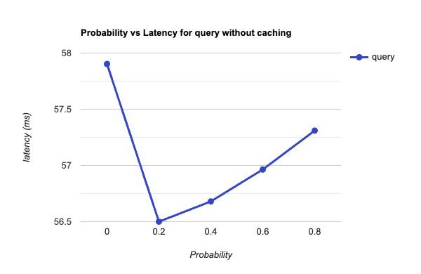

## Setup:

Server is deployed on AWS Instance and Clients are run on local machine.

### AWS Deployment:

#### EC2 Environment:

Instance Id: i-03fe35c6284d98f1c
Public DNS: ec2-54-226-245-163.compute-1.amazonaws.com
Public IP: 54.226.245.163
Instance Type: m5d.large(2vCPU, 8GiB memory)
Region : us-east-1

#### Steps:

- Updated aws config and credentials 

- Built instance using below command
```
aws ec2 run-instances --image-id ami-0d73480446600f555 --instance-type m5d.large --key-name vockey > instance.json
```

- Got instance details and ran below command to get public Ip and DNS.
```
aws ec2 describe-instances --instance-id i-03fe35c6284d98f1c
```

- Exposed front-end service port using below command
```
aws ec2 authorize-security-group-ingress --group-name default --protocol tcp --port 8889 --cidr 0.0.0.0/0
```

- SSH into instance and install java

```
ssh -i labuser.pem ubuntu@ec2-54-226-245-163.compute-1.amazonaws.com
sudo apt update
sudo apt install openjdk-8-jdk
```

- Create separate directories for each service
```
mkdir frontend
mkdir order
mkdr catalog
```

- Copy binaries(jar) of all the services from local to EC2 instance by running below commands in local machine. 

```
scp -i labuser.pem catalog-1.0-SNAPSHOT-jar-with-dependencies.jar ubuntu@ec2-54-226-245-163.compute-1.amazonaws.com:~/catalog/
scp -i labuser.pem frontend-1.0-SNAPSHOT-jar-with-dependencies.jar ubuntu@ec2-54-226-245-163.compute-1.amazonaws.com:~/frontend/
scp -i labuser.pem order-1.0-SNAPSHOT-jar-with-dependencies.jar ubuntu@ec2-54-226-245-163.compute-1.amazonaws.com:~/order/
```

- Create a copy of productCatalog in catalog folder and order files in order folder

```
touch order1.csv
touch order2.csv
touch order3.csv
touch orderLog1.csv
touch orderLog2.csv
touch orderLog3.csv
```

- Run the binaries using commands given in `README.md` file in background using `nohup`

Below image shows list of processes running in EC2 instance.


### Server Details:

Front-End Service is running with thread pool size of 10(initially with useCache as false,next with useCache as true). If we are using cache, CACHE_SIZE is 10.

Catalog Service is running with thread pool size of 10. Number of products in catalog are 15, initially quantity of each item is 100. Item details :  {"Lego","Barbie","Tinkertoy","Marbles","Bicycle","Crayolacrayon","Rollerskates","Frisbee","Monopoly","LincolnLogs","Whale", "Tux", "Fox", "Python"}

We are running three replicas of Order Service, each with thread pool size of 10. Id of replicas are 1,2 and 3.


### Client Details:

We are running 5 clients with varying p(0 to 0.8) to record latencies.

### Cost Analysis:

We have run instance for around 3.2 hours(200 mins) for over all testing

On-Demand hourly rate of m5d.large is around $0.113, I am ignoring all other costs (Elastic Ip and storage costs) are they are negligible.

So total cost = ($ 0.113) * 3.2 = $0.3616 (approx)


## Plots:

We are iterating over 1000 times to find average latency

### Query without caching

Below plot represents average latency for order probability v/s query request(without caching) 



### Query with caching

Below plot represents average latency for order probability v/s query request(with caching)


### Purchase without caching

Below plot represents average latency for order probability v/s buy request(without caching)


### Purchase with caching

Below plot represents average latency for order probability v/s buy request(with caching)


### Observations:

- We can see for query latency is slightly higher when p=0 because of new connection establishment, later on its almost constant and didn't vary much.
- We can see for purchase latency is 0 for p=0 because there are no buy requests , later on it follows slight increasing trend (peak at 0.6 or 0.8).
- We can observe latency of purchase is higher than latency of buy request(both with and without caching)
- We can see in both the cases(query and purchase), caching has improved the performance by around 15-20 ms
- There is slightly better improvement in performance of query than purchase because purchase still has overhead of updating item


## Questions:

1. Can the clients notice the failures (either during order requests or the final order checking phase) or are they transparent to the clients? Do all the order service replicas end up with the same database file?

- Clients cannot notice failures and they are transparent to the clients. In purchase or query_order operations, we are catching Connection Refused exceptions , re-electing the leader and retrying same request with new leader.Client is unaware of all this, so we can say during order requests we achieved failure transparency.

- If the crashed replica comes online,when we are checking the database files then `YES`, all order service replicas end up with the same database file. Whenever crashed replica comes online it will ask leader node for lost data and synchronizes with its file. 

Above statements have been verified by killing a random order service replica while the clients is running and bringing back them online after some time. Below output refers to output of data sanity testing done by client
(Refer to fault tolerance section in TESTING.md for more detailed steps)


