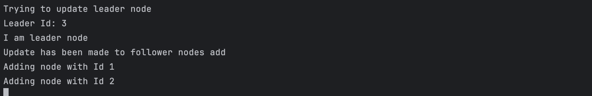
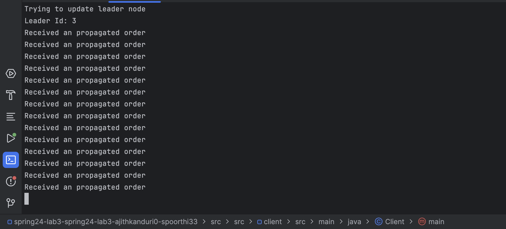
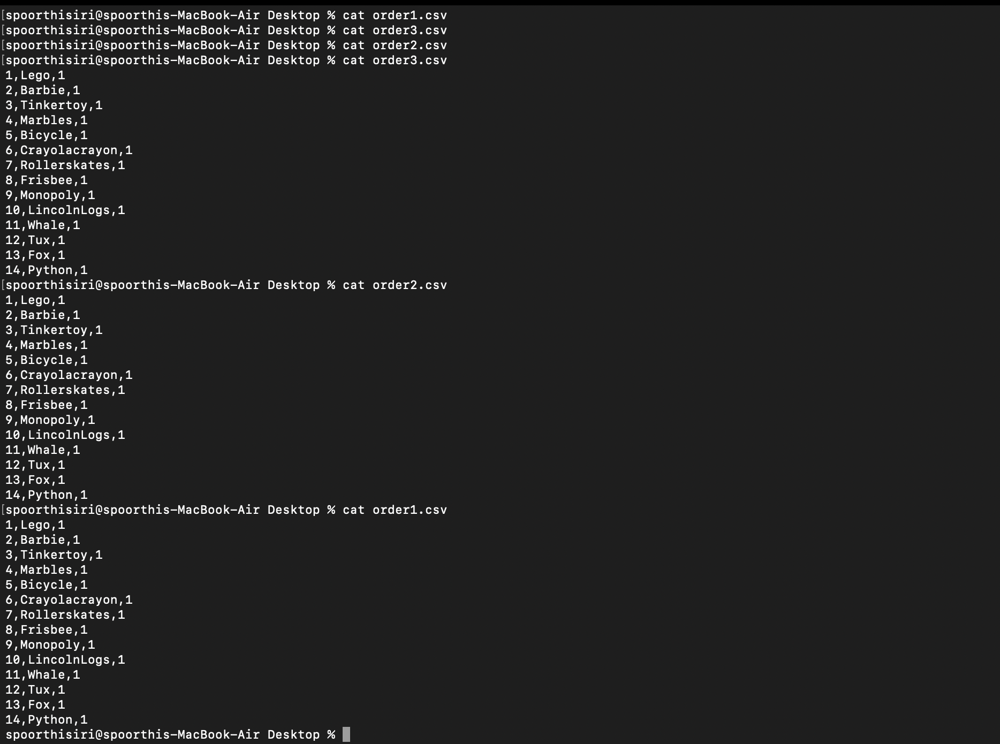
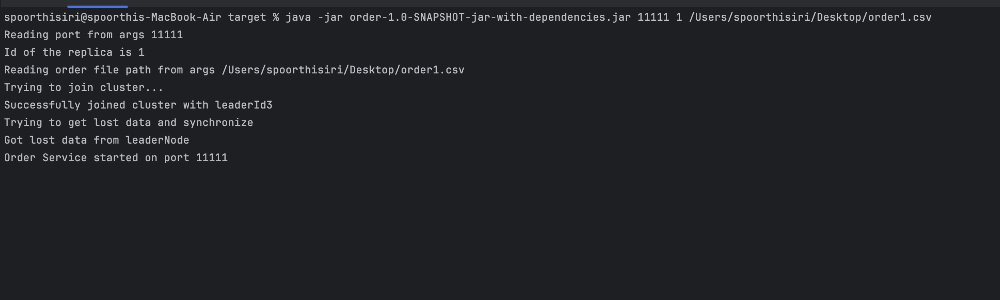

## Testing Strategy

We have implemented testing in two phases. For order and catalog service's we have implemented unit test's to verify functionality.
To test overall flow, we have separated test-cases

## Unit Testing

### Catalog Service

In `src/src/catalog/src/test/java/CatalogTests.java` unit test's have been implemented to test query and buy flow.

Below image show's that all the test cases have been passed.

### Order Service

In `src/src/order/src/test/java/OrderTests.java` unit test's have been implemented to test placing order flow.

Below image show's that all the test cases have been passed.

Below image show's that order.csv file has been updated successfully

## Flow Testing

### Caching: 

#### Cache working :

Lets make a query request to front-end for  `Whale` twice, initially it should make call to catalog, 2nd time it should fetch from cache.

We can also see catalog service is only queried once

#### LRU Cache:

We will verify if our cache is honoring LRU, let's call `Lego` 1st and then other 10 items , now Lego should be evicted from cache.

In above image, Lego is evicted when cache size is reached.

#### Cache invalidation on Buy:

We will 1st query `Lego` twice, then we will buy `Lego` and then query again.

As you can see, we fetched from cache 2nd time and later on cache was invalidated on buy request, hence we again queried catalog service.

#### Cache invalidation on Restock:

Let's call `Tux` 110 times , 1st 100 calls will succeed , after that restocking will take place and invalidate cache will be called.

Catalog has restocked items and then calls front-end for invalidation

Front-End has received bulk request(could be multiple items restocked).

### Replication:

#### Leader Election:

Let's start 3 replicas of order service with id's 1,2,3.

Let's start front-end service with below config

We can see that node 3 has been elected as leader

We can see above, leader node has been notified about leader election and follower nodes

#### Order Propagation:

Let's do a buy operation on clean slate for all the items.

We can see that leader Node(3) is propagating order to follower nodes(1,2)

We can see that follower node has been received by follower

We can see initially all the files are empty, later we can see all the files have been updated with order details.

### Fault Tolerance:

#### Crash Detection (Follower Node):

With same above environment, let's first crash follower node 1 and see 

We can see,Front-End identified node 1 has crashed and informed leader about crash.

Let's make 5 buy requests and see that updates are made only to node 2

#### Sync when follower node comes online:

Let's look at state of order files before node1 comes online

Now lets bring node 1 online

We can see, follower node is trying join cluster, getting data from leader node and sync data.

We can see, request has been made to join cluster, updates leader and once leader accepts, new node has joined the cluster

We lets compare 2 files and check state of DB

We can see both the files are synchronized.

#### Crash Detection and Sync in case of leader:

Now let's crash leader node and check 

We can see that front-end is reelecting since crashed node is leader

In replica 2 logs, we can see replica3 was leader before,now it has been elected as the leader.

Let's make 5 calls to front-end service and compare DB files associated with replica 2(current leader) and replica 3(prev leader)

We can see that DB of replica2 is updated but not of replica3.

Let's bring back crashed node and check sync.

We can see, replica 3 is now in sync with replica 2

### Consensus using RAFT:

Let's now run order replicas with useRaft flag as true.

#### Propagation of logs:

When leader node receives order, it will append log with transaction status as `P(pending)`, and replicates the log to follower node.

Since all replicas are up we have received 3 positive votes. Since it got majority of the votes

1. It will commit the log and order is written into DB.
2. It will send ack to follower nodes

We can see that follower's received ack and they committed the log and also updates the transaction status to `S(success)`

#### Crash of 1 replica :

Let's crash replica 1, and see 

We can see that log is still getting committed since it has majority of the votes.

#### Sync when crashed replica comes online:

Let's see state of log files and DB of replica 1 and replica 3(leader node) before we bring replica up..

Let's bring crashed replica up...

We can see that crashed replica will fetch lost data and synchronizes. Now see state of log files and DB of replica 1 and replica 3(leader node)

We can see lost data is synchronized.

#### Crash of 2 replicas :

Let's crash 2 replicas (1,2)  

We can see that log has been rolled back since it didn't get majority voting

We can see that buy request has failed because of DB replication failure.

### Overall Response:

Overall response seen by client will same as lab2

